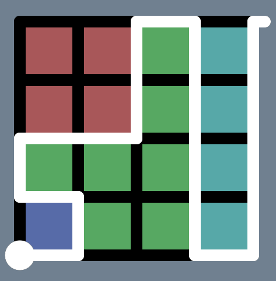
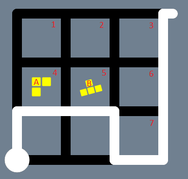
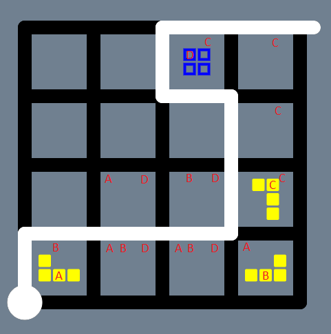
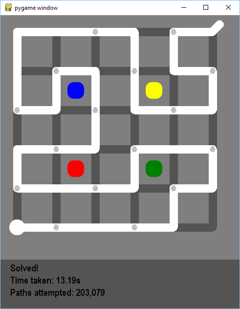

# ttws - The "The Witness" Solver

## Spoilers!

In order to explain how the solver works, the puzzle mechanics will be described which may ruin your experience of the game.  Read no further if you don't want that to happen!

## Requirements

Written in Python 2.7.  `pygame` is used to draw the puzzle.  Google protobuf is used to decode The Windmill puzzles.  These can be installed with:

```
pip install pygame protobuf
```

## Usage

`python ttws.py`
With no arguments, a random puzzle will be generated, which may or may not be solvable!
When a puzzle is loaded, the solver will begin immediately.

```
  Arguments:
    -f/--file <file>              Load a file containing one puzzle on each line
    -p/--puzzle <encoded_puzzle>  Load a single puzzle
```
```
  Keys:
    q                  Quit
    n                  Generate a random puzzle
    s                  Restart solving a puzzle using deterministic path finding
    r                  Restart solving a puzzle using random path finding
    Left/right arrow   If a file has been loaded, load the previous/next puzzle from the list
    p                  Paste an encoded puzzle from the clipboard
```

Puzzle encoding is taken from [The Windmill](https://windmill.thefifthmatt.com/).  If you build a puzzle click on checkpoint, or load a puzzle and click on edit, the long URL string can be pasted into the solver, or loaded from the command-line or from a file.

When a puzzle is pasted into the solver, it is appended to a file called `known_puzzles`, so all pasted puzzles are saved.

All puzzles from The Windmill as of 9 September 2017 are in a file called `windmill_puzzles` so `python ttws.py -f windmill_puzzles` will begin to load and solve these.  Note that they are not all solvable as some validation rules mismatch.  Also, some will take forever to solve.

Many puzzles that you will come across in the game are in `witness_puzzles`.

## Motivation

[The challenge](http://uk.ign.com/wikis/the-witness/The_Caves) (the one in the game, not just the challenge of writing a solver)!  I enjoyed playing The Witness and learning the puzzle mechanics.  Throughout the game, I wondered how it might be possible to write a solver.  When I got to the challenge, though, the randomised puzzles and time pressure made me realise that a solver which could capture puzzles from the screen, interpret them and solve them immediately would be incredibly helpful.  Needless to say, I finished the challenge long before this solver...

## UI

A UI is necessary to visualise what's going on, but it's not the interesting part of this project, so the code is pretty messy and hacky.

## Path finding

A depth first search is used to traverse every possible path over the puzzle, from each start node.  A "path" is a list of nodes, even if it doesn't reach an end node, so an empty 1x1 puzzle actually has 7 paths:


These paths are:

```
[(0, 1)]
[(0, 1), (1, 1)]
[(0, 1), (1, 1), (1, 0)]
[(0, 1), (1, 1), (1, 0), (0, 0)]
[(0, 1), (0, 0)]
[(0, 1), (0, 0), (1, 0)]
[(0, 1), (0, 0), (1, 0), (1, 1)]
```

Naturally, traversing these 7 paths takes almost no time at all but, as the board size increases, the number of potential paths increases exponentially:

| Puzzle Size | Number of Paths    | Approximate Time to Explore |
|-------------|--------------------|-----------------------------|
| 1x1         | 7                  | 0s                          |
| 1x2         | 18                 | 0s                          |
| 2x2         | 79                 | 0s                          |
| 2x3         | 309                | 0s                          |
| 3x3         | 2,111              | 0s                          |
| 3x4         | 13,591             | 0s                          |
| 4x4         | 153,745            | 0s                          |
| 4x5         | 16,70,522          | 11s                         |
| 5x5         | 31,811,177         | 4m                          |
| 5x6         | 588,083,855        | 1h 30m                      |
| 6x6         | 4.2e10 (estimated) | 2.5 days                    |
| 6x7         | 1.8e12 (estimated) | 116 days                    |
| 7x7         | 1.5e14 (estimated) | 26 years                    |
| 8x7         | 1.3e16 (estimated) | 2,000 years                 |
| 8x8         | 2.0e18 (estimated) | 340,000 years               |

And this is just looking at every available path from a given start node, not even attempting to solve anything!

## Finding areas

Once a valid path (one which reaches an end node) has been drawn, areas are identified using [flood filling](https://en.wikipedia.org/wiki/Flood_fill).  For example, the following path defines 4 areas:



It may appear more efficient to try to solve simple pieces first, e.g. triangles, so a path may be rejected as quickly as possible.  However, triangles may be removed in the presence of elimination marks, and we can't tell if a triangle and elimination mark will be in the same area until areas are identified so, unfortunately, this is not an optimisation which would work in all cases.  It would be possible for the code to behave differently if a puzzle contained no elimination marks, but it's not clear that that optimisation would be worthwhile without some benchmarking.

## Hexagons and triangles

The rules for hexagons and triangles are easy to understand.

## Yellow tetris

Any yellow tetris pieces within an area (in which there are no blue tetris pieces) must fit exactly into that area.  This is a class of problem known as [exact cover](https://en.wikipedia.org/wiki/Exact_cover) and can be solved relatively easily and efficiently with [Donald Knuth's Algorithm X](https://en.wikipedia.org/wiki/Knuth%27s_Algorithm_X).  It is worthwhile reading and understanding this algorithm.  The implementation used is [this one](http://www.cs.mcgill.ca/~aassaf9/python/algorithm_x.html) from Ali Assaf.  Again, it is worthwhile reading and understanding the code as there are some interesting subtleties in there.

In order to build a representation of a tetris puzzle suitable for Algorithm X, every cell and each piece becomes a column.  Every possible placement/orientation combination of every piece make up the rows.  A solution is found when selecting certain rows leaves each column containing just one 1.  This is easier to understand with an example.  Consider the following puzzle:



Label each cell from 1 to 7, call the 3-piece A and the 4-piece B.  Attempt to place each piece in every possible position in every possible orientation.  Call successful placements A1, A2 etc.  Then build rows and columns as follows:

|  |  1  |  2  |  3  |  4  |  5  |  6  |  7  |  A  |  B  |
|--|-----|-----|-----|-----|-----|-----|-----|-----|-----|
|A1|**1**|**1**|  0  |**1**|  0  |  0  |  0  |**1**|  0  |
|A2|  0  |  1  |  1  |  0  |  1  |  0  |  0  |  1  |  0  |
|B1|  1  |  1  |  1  |  0  |  1  |  0  |  0  |  0  |  1  |
|B2|  0  |  0  |**1**|  0  |**1**|**1**|**1**|  0  |**1**|

This can then be fed into the algorithm which will yield the highlighted result (A1, B2), which uses each column exactly once.

The addition of each piece as columns essentially tells the algorithm that each piece may be used only once, i.e. once a row is selected, no other row for that piece may be selected.

## Blue tetris

There is a puzzle in the marsh area of The Witness which demonstrates that blue tetris pieces can cancel out yellow tetris pieces which fall outside of the defined area:



Given that a blue tetris piece may, therefore, end up anywhere on the board, the approach taken is to place every piece in every combination which will fit on the board and store all valid areas.  The number of combinations for `n` pieces on an `x` by `y` board is `(x * y) ^ n`.  This quickly gets out of control, so considering more than about 5 pieces in an area becomes prohibitively slow.

There is one reasonably easy optimisation which can be applied.  When placing pieces on the board, a count for each cell is started at zero.   A yellow piece adds one to the cell count and a blue piece subtracts one.  We know that yellow count minus blue count must be one for a cell in an area.  Therefore, if there are not enough remaining pieces to ever get the cell count back to one, the area must be invalid so we can break out early.

It is not clear from the game whether tetris pieces falling outside of the board area can be valid or not.  This implementation does not allow it.  It's quite easy to enable but the board then becomes 2 cells wider (left and right) and 2 cells higher (top and bottom) for every one row/column out-of-bounds checked.

Many different approaches for blue tetris solving were considered, but none quite worked for all cases so brute force fitting was implemented as a last resort.

## Squares and stars

It is important to note that a blue tetris piece, yellow tetris piece and orange triangle can be used to match a star of the same colour and produce a valid pair.  A white elimination mark cannot match a white star, as it is effectively removed from the board along with the piece being eliminated.

## Elimination marks

When considering elimination marks within an area, the first step is to remove any invalid pieces.  Hexagons and triangles are either valid or invalid, so these can be removed straight away.

Next, fixed pieces must be identified.  Valid triangles are fixed orange pieces.  For tetris pieces, however, there maybe multiple valid combinations and, therefore, multiple combinations which can be removed.  So the algorithm becomes:

```
Whilst validating triangles, keep a record of how many must be removed and how many must remain.
Whilst validating hexagons, keep a record of how many must be removed and how many must remain.
Eliminate extra stars if there are more than 2 of any colour.
Iterate over all possible combinations of tetris pieces, considering that somewhere from zero to all remaining elimination marks may be used.
    Loop over every colour of square (or all colours if there are no squares).
        If there are other squares of this colour, they must be eliminated.
        Loop over every colour of star.
            If there is one star, there must be exactly one fixed piece, otherwise remove the star.
            If there are two stars, there must be exactly no fixed pieces, otherwise remove both stars.
            If this combination of removed pieces use up all elimination marks, area is valid.
```

Each time an item must be removed, the remaining number of elimination marks is checked and, if there aren't enough, the combination is invalid.

## Invalid areas/paths

If an area is found to be invalid, it can hugely reduce the path finding search tree to remember it and never consider that area again.  However, storing invalid areas can quickly use up a lot of memory.  Given that path finding traversal works by storing potential paths to consider in a queue, it is sufficient to simply remove invalid areas from the current queue.  As the queue contains paths rather than areas, the path around the invalid area must first be found and then anything on the queue containing this sub-path can be removed.  This has substantial performance benefits, for example:

|||
|:---:|:---:|
|Before invalid path removal|After invalid path removal|

One complication is that, if a puzzle contains multiple end nodes, an area can be marked as invalid which may be valid if another end node is chosen.  Therefore, areas containing an end node (which is not the one on the current path) are ignored.

## Further work 

Capturing puzzles from the screen (using PIL?) and automatically interpreting and solving them.

Support for coloured hexagons, which means coloured paths when symmetry is involved.

It would be good to indicate how far through blue tetris solving (or solving in general) we are, along with an estimate of time remaining.  A user could then decide that 340,000 years was too long to wait.  Alternatively, a faster blue tetris solver would be better!

There is plenty of scope for more heuristics to reduce the search space.  For example, if there are no elimination marks, an invalid triangle or hexagon immediately invalidates an area.

An sqlite database storing puzzles and their solutions.  Solutions could then be loaded immediately without having to run the solver again.

Buttons on the interface to allow skipping through puzzles in the database, random solving, pasting a puzzle from the clipboard, toggling out-of-bounds blue tetris solving etc.
